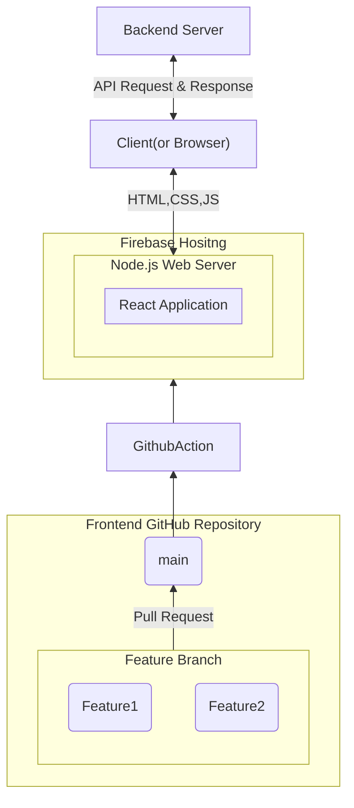

# 📖 Link Up


- 코딩 스터디부터 러닝 크루까지 다양한 모임을 만들고 찾을 수 있는 서비스입니다.
- 프로젝트 기간 : 24년 12월 6일(금) ~ 24년 12월 23일(월) (약 2주)

[프로젝트 깃허브](https://github.com/Team-LinkUp)
[프론트 깃허브](https://github.com/chaesunbak/study-matcher-frontend)
[백엔드 깃허브](https://github.com/damhyeong/Programmers_TeamRepo)
[팀 노션 페이지](https://www.notion.so/Link-Up-2882ea41fbc64059970ebd5e8e3962c2?pvs=4)


## 1. 팀원 구성

<div align="center">

## Team

|||||
|:-:|:-:|:-:|:-:|
|Cho SeungYeon<br/>[@layout-SY](https://github.com/layout-SY)|[@chaesunbak](https://github.com/chaesunbak)|damhyeong<br/>[@damhyeong](https://github.com/damhyeong)|[@Kim-Hyunhee](https://github.com/Kim-Hyunhee)|
|프론트엔드|프론트엔드|백엔드|백엔드|


</div>

## 2. 역할 분담

### 🍊 조승연

- 유저 페이지
- 글, 댓글 페이지

### 👻 채문성

- 모임찾기, 모임 상세보기 페이지
- 반응형 레이아웃

### 🌝 공담형

- 유저 CRUD API 제작
- CI / CD 제작
- AWS 인프라 관리

### 😎 김현희

- 모임, 게시글, 댓글 CRUD API 제작

<br>

## 3. 프론트엔드 기술스택

React : 재사용성 높은 컴포넌트와 훅을 적극 활용하여 유지 보수성을 높였습니다.

React-Router : 단일 페이지 애플리케이션(SPA)에서 부드러운 페이지 전환을 위해 React-Router를 사용했습니다. 중첩된 레이아웃을 구현하여 일관된 UI를 제공하였습니다.

Axios : 인증 정보를 효율적으로 관리하고 중복 코드를 줄이기 위해 Axios Instance와 Intercepter 를 활용했습니다

TailwindCSS : 빠른 UI 개발과 일관된 디자인 시스템을 위해 Tailwind CSS를 사용했습니다. 이를 통해. 반응형 레이아웃과 다크모드를 빠르게 구현할 수 있었습니다.

Zustand : 다른 전역 상태 라이브러리 보다 간단히 사용자의 로그인/로그아웃을 해결 하였고, 로그인을 통한 사용자 데이터를 전역에서 다뤄 보다 편리하게 기능 구현이 가능 했습니다.

Zod : 강력한 타입 기반 유효성 검사를 위해 Zod를 사용했습니다. Zod의 상세한 에러 메시지를 활용하여 사용자에게 명확한 피드백을 제공했습니다

React-Hook-Form : 폼 상태 관리 및 유효성 검사를 간편하게 처리하기 위해 React-Hook-Form을 사용했습니다.

@tanstack/react-query : 캐싱을 사용하여 반복요청을 줄였습니다.


## 4. 서비스 흐름도


<details>
<summary>프론트엔드 서비스 흐름도</summary>

<!-- summary 아래 한칸 공백 두어야함 -->


</details>

## 4. 폴더 구조
```
.github: GitHub 관련 설정 파일들이 있는 디렉토리
node_modules: 프로젝트의 외부 dependencies가 설치되는 디렉토리
public: 정적 파일들이 위치하는 디렉토리
src: 소스 코드의 메인 디렉토리
├── api: API 호출 관련 코드
├── components: 재사용 가능한 React 컴포넌트들
├── hooks: 커스텀 React hooks
├── models: 데이터 모델/타입 정의
├── pages: 페이지 컴포넌트들
├── store: 상태 관리 관련 코드
├── utils: 유틸리티 함수들
├── firebase.ts: Firebase 설정/초기화 파일
├── index.css: 글로벌 CSS
├── main.tsx: 앱의 진입점
```


## 5. 페이지 구성
홈 (/)

모임 찾기 (/search)

모임 개별 조회 (groups/:group_id) 
모임 멤버 조회 (groups/:group_id/members)
모임 게시글 목록 조회  (groups/:group_id/posts)
모임 게시글 작성  (groups/:group_id/posts/write)
모임 게시글 개별 조회 (groups/:group_id/posts/:post_id)
모임 관리 페이지 (groups/:group_id/manage)

로그인 (/login)
회원가입 (/signup)
비밀번호 재설정 (/reset-password)

마이페이지 (/profile)
내 정보 수정  (/profile/modify)
내 그룹 관리 (/profile/manage)
로그아웃  (/profile/logout)
회원탈퇴  (/profile/withdraw)

## 6. 트러블 슈팅

## 7. 회고
